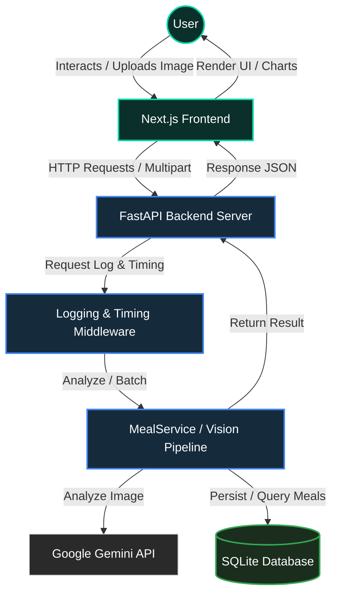
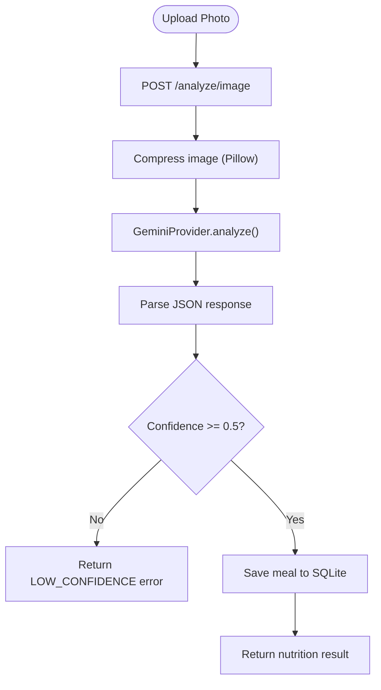

<p align="center">
  
</p>

<h1 align="center">Veonix</h1>

<p align="center">
  <a href="https://github.com/mariiammaysara/Veonix/actions/workflows/ci.yml"></a>
  
  
  
  
  
</p>

An AI-powered nutrition tracker that estimates calories and macronutrients directly from food photographs.

The project is a FastAPI backend around a single Gemini vision call, paired with a responsive Next.js dashboard for uploading meals (single or batch) and reviewing history.

---

## Table of Contents

- [Overview](#overview)

- [Architecture](#architecture)

- [Features & Tech Stack](#features--tech-stack)

- [Known Limitations](#known-limitations)

- [Project Structure](#project-structure)

- [Installation & Setup](#installation--setup)

- [Contributing](#contributing)

- [License](#license)

---

## Overview

Veonix is a simple web application that helps you track your daily nutrition. You can upload a photo of your meal, and the AI (Google Gemini Flash) will automatically identify the food and calculate its calories, protein, carbs, and fat.

You can also upload several photos at once for a quick batch analysis (each image is analyzed in parallel, with totals aggregated across the batch), and every analyzed meal is saved to your history with simple aggregate stats.

There is no user authentication yet, so history and stats are shared across everyone using a given deployment — treat it as a single-user local tool for now.

---

## Architecture

### System Flow


### Request Flow (Single Image)



Batch uploads (`POST /analyze/images/batch`) run the same per-image pipeline concurrently via `asyncio.gather`, then aggregate totals across all successfully analyzed images.

### Component Breakdown

| Pipeline Stage | Core Technology | Component & Operations |
| :--- | :--- | :--- |
| **Frontend UI** | Next.js, Tailwind, Framer Motion | Image upload (single & batch), macro ratio charts, history view |
| **Backend API** | FastAPI, Pydantic v2, Pillow | Endpoint routing, CORS validation, and image compression |
| **Vision Pipeline** | Google Gemini Flash | Single multimodal call per image: food identification + nutrition estimate |
| **Database** | SQLite, SQLAlchemy | Meal storage, history, and aggregate stats (schema created directly on startup, no migrations) |

---

## Features & Tech Stack

This project is divided into two main parts: the backend API and the frontend website.

### Backend & Database

* **FastAPI** — High-performance Python web framework.

* **Google Gemini Flash** — Multimodal AI used to identify foods and estimate weights and nutrition in a single call.

* **SQLite with SQLAlchemy** — Saves meals and history using the Repository Pattern (Controllers → Services → Providers → Repositories).

* **Pillow** — Resizes and compresses uploaded photos to make API requests faster.

* **Pydantic v2** — Checks all input and output data to prevent errors.

* **asyncio.gather** — Powers parallel batch image analysis with no extra orchestration framework.

### Frontend & User Interface

* **Next.js App Router** — Fast React framework with server-side rendering for a smooth user experience.

* **TypeScript** — Prevents coding bugs by checking types.

* **Tailwind CSS** — Utility-first styling engine for a clean design.

* **Framer Motion** — Smooth transition effects and loading animations.

* **Lucide React** — Clean, modern icon pack.

* **Key Features**:
  * Drag-and-drop food photo uploader with real-time image preview.
  * Multi-photo batch upload with aggregated nutrition totals.
  * Meal history with delete support and simple average-nutrition stats.
  * Local-only preferences page (dietary goal / allergies note) stored in the browser — not synced anywhere, since there's no account system yet.

### DevOps & Infrastructure

* **Docker & Docker Compose** — Runs the frontend and backend in containers.

* **GitHub Actions** — Automated testing and CI/CD.

---

## Known Limitations

- It is difficult to guess the exact weight of food from a photo. For better results, you would need a reference object (like a coin or hand) next to the food.
- Currently, the app uses Gemini AI to guess weights. This is not always 100% accurate.
- Future plan: allow users to type the food weight themselves.
- There is no authentication yet — all meal history and stats are shared across anyone using a given deployment.

---

## Project Structure

```
veonix/
├── backend/
│   ├── src/
│   │   ├── controllers/ # API routes (analyze, health)
│   │   ├── db/          # database session & repositories
│   │   ├── providers/   # Gemini vision integration (factory pattern)
│   │   └── services/    # core business logic (MealService)
│   └── tests/           # backend tests
└── frontend/
    ├── app/             # Next.js pages & dashboard
    └── components/      # UI elements & charts
```

---

## Installation & Setup

### 1. Clone the Repository
```bash
git clone https://github.com/mariiammaysara/Veonix.git
cd Veonix
```

### 2. Prerequisites

Make sure you have these tools installed on your computer before you start:

* **Required Tools**:
  * **[Node.js](https://nodejs.org/) (v20 or higher)** — To run the frontend website.
  * **[Python](https://www.python.org/downloads/) (v3.11 or higher)** — To run the backend server.
  * **[Docker & Docker Compose](https://docs.docker.com/get-docker/)** — To run the whole application easily in containers (optional).
* **API Keys**:
  * **[Gemini API Key](https://aistudio.google.com/app/apikey)** — Needed to analyze food images.

---

### 3. Environment Configuration

You need to set up environment variables (API keys and configuration) for the frontend and backend. You can do this in the main folder (for Docker) or inside each folder (for running locally).

#### Root Configuration (For Docker Compose)
Copy the example file and add your keys:
```bash
cp .env.example .env
```
Open `.env` and set `GEMINI_API_KEY` with your Gemini API key.

#### Local Configuration (For running without Docker)
* **Backend:**
  ```bash
  cd backend
  cp .env.example .env
  ```
  Open `backend/.env` and set `GEMINI_API_KEY=your_actual_key`.

* **Frontend:**
  ```bash
  cd frontend
  cp .env.example .env.local
  ```
  Open `frontend/.env.local` and make sure it has:
  * `NEXT_PUBLIC_API_URL=http://localhost:8000`

---

### 4. Running the Application

Choose one of these two ways to start the app:

#### Method A: Using Docker Compose (Easiest way)

This builds and runs both the backend (FastAPI) and frontend (Next.js) together.

1. Make sure you have created and configured the root `.env` file.
2. Start the containers:
   ```bash
   docker-compose up --build
   ```
3. Open the app:
   * **Frontend Website**: [http://localhost:3000](http://localhost:3000)
   * **Backend API Docs**: [http://localhost:8000/docs](http://localhost:8000/docs)

---

#### Method B: Running locally (Without Docker)

If you want to run the backend and frontend separately:

##### 1. Backend Setup & Run
1. Go to the backend folder:
   ```bash
   cd backend
   ```
2. Install Python packages:
   ```bash
   pip install -r requirements.txt
   ```
3. Start the FastAPI server:
   ```bash
   uvicorn src.main:app --reload
   ```
   The backend will run at `http://localhost:8000`. The SQLite schema is created automatically on startup — no migrations to run.

##### 2. Frontend Setup & Run
1. Go to the frontend folder:
   ```bash
   cd frontend
   ```
2. Install Node packages:
   ```bash
   npm install
   ```
   Start the Next.js development server:
   ```bash
   npm run dev
   ```
   The frontend will run at `http://localhost:3000`.

---

#### Production Deployment (Docker)

To run the application in production mode:
```bash
# Build production images
docker-compose -f docker-compose.yml build

# Run in background (detached mode)
docker-compose up -d
```

---

## Contributing

We welcome contributions! Whether you want to fix a bug, add a new feature, update documentation, or report an issue, your help makes Veonix better for everyone.

### Getting Started

1. **Fork** the repository on GitHub.
2. **Clone** the repository to your computer:
   ```bash
   git clone https://github.com/mariiammaysara/Veonix.git
   cd Veonix
   ```
3. Create a new **branch** for your work:
   ```bash
   git checkout -b feature/amazing-feature
   ```
4. **Commit** your changes with clear messages:
   ```bash
   git commit -m "feat: add amazing new feature"
   ```
5. **Push** the branch to GitHub:
   ```bash
   git push origin feature/amazing-feature
   ```
6. Open a **Pull Request** on GitHub.

Thank you for being part of the Veonix community!

---

## License
Distributed under the MIT License. See `LICENSE` for more information.

---

## Author
<p align="center">
  © Built by <b>Mariam Maysara</b>
</p>

---

<div align="center">

**Built by Mariam Maysara to showcase multi-modal nutrition analysis with a clean Controllers → Services → Providers → Repositories backend architecture.**

</div>
