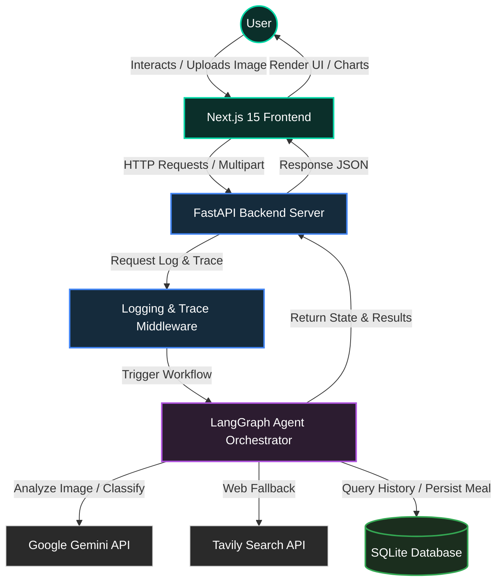
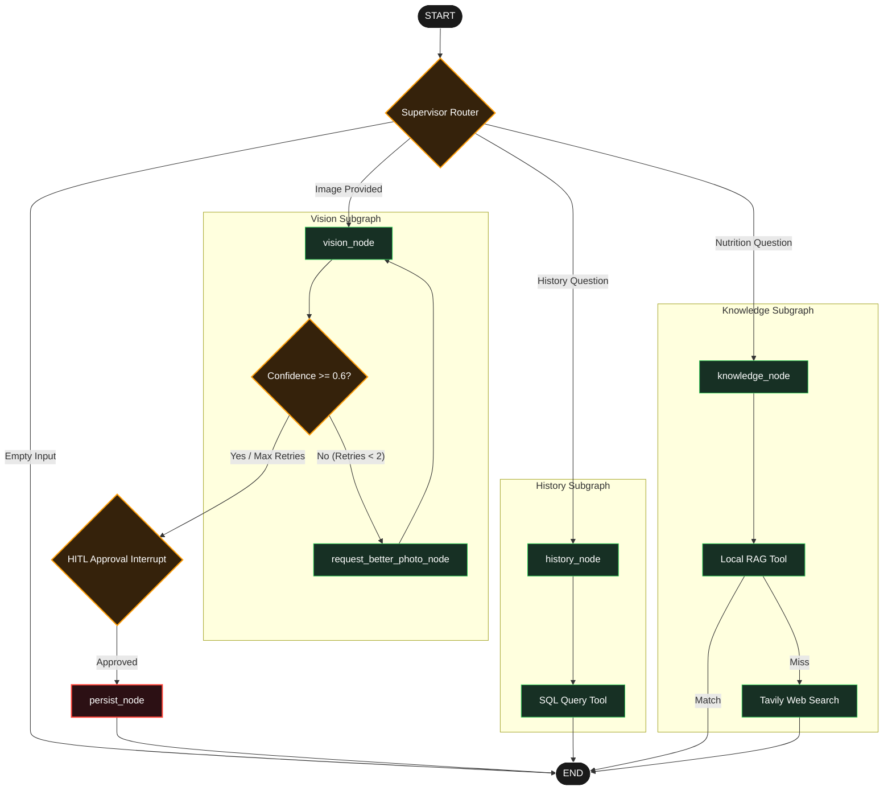

<p align="center">
  
</p>

<h1 align="center">Veonix</h1>

<p align="center">
  
  
  
  
  
</p>

An AI-powered nutrition tracker that estimates calories and macronutrients directly from food photographs.

The project features a FastAPI backend driven by a LangGraph agent orchestrator, a responsive Next.js 15 dashboard, and an integrated Model Context Protocol (MCP) server for Claude Desktop.

---

## Table of Contents

- [Overview](#overview)

- [Architecture](#architecture)

- [Features & Tech Stack](#features--tech-stack)

- [Known Limitations](#known-limitations)

- [Project Structure](#project-structure)

- [Installation & Setup](#installation--setup)

- [MCP Server](#mcp-server)

- [Database Migrations & Deployment Notes](#database-migrations--deployment-notes)

- [Contributing](#contributing)

- [License](#license)

---

## Overview

Veonix is a simple web application that helps you track your daily nutrition. You can upload a photo of your meal, and the AI (Google Gemini 2.5 Flash) will automatically identify the food and calculate its calories, protein, carbs, and fat. 

It also stores your meal history, allows you to query past logs, and includes an AI nutrition coach to answer questions using a local Knowledge Base (RAG) and web search fallback.

---

## Architecture

### System Flow


### LangGraph Agent Orchestrator Workflow


### Component Breakdown

| Pipeline Stage | Core Technology | Component & Operations |
| :--- | :--- | :--- |
| **Frontend UI** | Next.js 15, Tailwind, Framer Motion | Image upload, macro ratio visual charts, and progress logs |
| **Backend API** | FastAPI, Pydantic v2, Pillow | Endpoint routing, CORS validation, and image compression |
| **Agentic Brain** | LangGraph, Gemini 2.5 Flash, Tavily | Query routing, image confidence checks, SQL database queries, and RAG |
| **Database** | SQLite, SQLAlchemy, Alembic | Saved meal storage, user setting configuration, and migration history |

---

## Features & Tech Stack

This project is divided into two main parts: the backend API and the frontend website.

### Backend & Database

* **FastAPI** — High-performance Python web framework.

* **Google Gemini 2.5 Flash** — Multimodal AI used to identify foods, estimate weights, and answer coaching questions.

* **SQLite with SQLAlchemy** — Saves meals, history, and user settings using the Repository Pattern.

* **Alembic** — Manages database updates automatically.

* **Pillow** — Resizes and compresses uploaded photos to make API requests faster.

* **Pydantic v2** — Checks all input and output data to prevent errors.

* **uv** — Extremely fast Python package manager used for local development.

### Frontend & User Interface

* **Next.js 15 App Router** — Fast React framework with server-side rendering for a smooth user experience.

* **TypeScript** — Prevents coding bugs by checking types.

* **Tailwind CSS** — Utility-first styling engine for a clean design.

* **Framer Motion** — Smooth transition effects and loading animations.

* **Lucide React** — Clean, modern icon pack.

* **Key Features**:
  * Drag-and-drop food photo uploader with real-time image preview.
  * Step-by-step progress animation while the AI is analyzing.
  * Visual charts showing daily macros and calories.

### DevOps & Infrastructure

* **Docker & Docker Compose** — Runs the frontend, backend, and database in container boxes easily.

* **GitHub Actions** — Automated testing and CI/CD.

---

## Known Limitations

- It is difficult to guess the exact weight of food from a photo. For better results, you would need a reference object (like a coin or hand) next to the food.
- Currently, the app uses Gemini AI to guess weights. This is not always 100% accurate.
- Future plan: allow users to type the food weight themselves.

---

## Project Structure

```
veonix/
├── backend/
│   ├── mcp_server/      # Claude Desktop integration
│   ├── migrations/      # Alembic migration scripts
│   ├── src/
│   │   ├── agents/      # LangGraph orchestration (graph, supervisor)
│   │   ├── controllers/ # API routes
│   │   ├── db/          # database session & repositories
│   │   ├── providers/   # Gemini / vision models integration
│   │   └── services/    # core business logic
│   └── tests/           # backend tests
└── frontend/
    ├── app/             # Next.js pages & dashboard
    └── components/      # UI elements & charts
```

---

## Installation & Setup

### 1. Clone the Repository
```bash
git clone https://github.com/mariiammaysara/Veonix.git
cd Veonix
```

### 2. Prerequisites

Make sure you have these tools installed on your computer before you start:

* **Required Tools**:
  * **[Node.js](https://nodejs.org/) (v20 or higher)** — To run the frontend website.
  * **[Python](https://www.python.org/downloads/) (v3.11 or higher)** — To run the backend server.
  * **[uv](https://docs.astral.sh/uv/)** — A very fast tool to install Python packages. Install it using `pip install uv`.
  * **[Docker & Docker Compose](https://docs.docker.com/get-docker/)** — To run the whole application easily in containers.
* **API Keys**:
  * **[Gemini API Key](https://aistudio.google.com/app/apikey)** — Needed to analyze food images and chat.
  * **[Tavily API Key](https://tavily.com/)** — Needed for the AI to search the web.

---

### 3. Environment Configuration

You need to set up environment variables (API keys and configuration) for the frontend and backend. You can do this in the main folder (for Docker) or inside each folder (for running locally).

#### Root Configuration (For Docker Compose)
Copy the example file and add your keys:
```bash
cp .env.example .env
```
Open `.env` and set:
* `GEMINI_API_KEY` with your Gemini API key.
* `TAVILY_API_KEY` with your Tavily API key.

#### Local Configuration (For running without Docker)
* **Backend:**
  ```bash
  cd backend
  cp .env.example .env
  ```
  Open `backend/.env` and write:
  * `GEMINI_API_KEY=your_actual_key`
  * `TAVILY_API_KEY=your_actual_key`
  
* **Frontend:**
  ```bash
  cd frontend
  cp .env.example .env.local
  ```
  Open `frontend/.env.local` and make sure it has:
  * `NEXT_PUBLIC_API_URL=http://localhost:8000`

---

### 4. Running the Application

Choose one of these two ways to start the app:

#### Method A: Using Docker Compose (Easiest way)

This builds and runs both the backend (FastAPI) and frontend (Next.js) together, and updates the database automatically.

1. Make sure you have created and configured the root `.env` file.
2. Start the containers:
   ```bash
   docker-compose up --build
   ```
3. Open the app:
   * **Frontend Website**: [http://localhost:3000](http://localhost:3000)
   * **Backend API Docs**: [http://localhost:8000/docs](http://localhost:8000/docs)

> **Note:** Docker uses `pip + requirements.txt` internally. The `uv` tool is only recommended for local development without Docker.

---

#### Method B: Running locally (Without Docker)

If you want to run the backend and frontend separately:

##### 1. Backend Setup & Run
1. Go to the backend folder:
   ```bash
   cd backend
   ```
2. Install Python packages using `uv`:
   ```bash
   uv sync
   ```
3. Update the SQLite database structure:
   ```bash
   uv run alembic upgrade head
   ```
4. Start the FastAPI server:
   ```bash
   uv run uvicorn src.main:app --reload
   ```
   The backend will run at `http://localhost:8000`.

##### 2. Frontend Setup & Run
1. Go to the frontend folder:
   ```bash
   cd frontend
   ```
2. Install Node packages:
   ```bash
   npm install
   ```
   Start the Next.js development server:
   ```bash
   npm run dev
   ```
   The frontend will run at `http://localhost:3000`.

---

#### Production Deployment (Docker)

To run the application in production mode:
```bash
# Build production images
docker-compose -f docker-compose.yml build

# Run in background (detached mode)
docker-compose up -d
```
---

## MCP Server

Veonix has an MCP (Model Context Protocol) server. This lets you connect your meal logs and stats directly to apps like Claude Desktop.

### What it can do:
- **Tool**: `get_meal_history` — Gets your past meals (newest first) with calories and macros.
- **Resource**: `nutrition://stats` — Shows average nutrition numbers and total meal count.

### Claude Desktop Configuration

To use the MCP server in Claude Desktop, add this to your configuration file (located at `%APPDATA%\Claude\claude_desktop_config.json` on Windows or `~/Library/Application Support/Claude/claude_desktop_config.json` on macOS):

```json
{
  "mcpServers": {
    "veonix": {
      "command": "python",
      "args": [
        "c:/Users/Mariam Hagag/Desktop/veonix/Veonix/backend/mcp_server/server.py"
      ],
      "env": {
        "PYTHONPATH": "c:/Users/Mariam Hagag/Desktop/veonix/Veonix/backend",
        "DATABASE_URL": "sqlite:///c:/Users/Mariam Hagag/Desktop/veonix/Veonix/backend/veonix.db"
      }
    }
  }
}
```

*Note: Make sure Python is installed and the packages `mcp` and `sqlalchemy` are installed.*

---

## Database Migrations & Deployment Notes

- **Database Updates**: You must run database migrations to update the database tables before starting the app. Docker runs this automatically on startup. If you run the app manually, run:
  ```bash
  alembic upgrade head
  ```
- **Hybrid Service Architecture (Render + LangGraph Platform)**:
  - **FastAPI Backend (Render)**: Handles authentication, database queries, and lightweight routes.
  - **LangGraph Platform**: Deploys and runs the agent graph directly, avoiding Render free-tier cold-start delays for agentic tasks.
  - **Cold-Start Fix**: Because the critical agent workflow is offloaded to the LangGraph Platform, it is immune to the typical 30-60 second Render free-tier cold-start complaint, keeping agent latency consistently low.

- **Observability Setup (Langfuse)**:
  Observability, tracing, and agent run metrics are self-hosted natively via **Langfuse v3**.
  
  To configure tracing:
  1. **Start the Stack**: Spin up the Docker Compose services in your project directory:
     ```bash
     docker compose up -d
     ```
  2. **Access the Console**: Open your browser and go to [http://localhost:3001](http://localhost:3001).
  3. **Register/Sign Up**: Click on **Sign up** to register a new local account (the data is fully stored in your local containerized database).
  4. **Generate Keys**: Create a new project inside the console, head to **Project Settings**, and copy the generated credentials:
     - `Public Key`
     - `Secret Key`
  5. **Add to Environment Files**: Paste these values in both your root `.env` and `backend/.env` files:
     ```bash
     LANGFUSE_PUBLIC_KEY=pk-lf-...
     LANGFUSE_SECRET_KEY=sk-lf-...
     LANGFUSE_HOST=http://localhost:3001
     ```
  Once the keys are in place, any meal uploads or AI coaching queries will automatically register real-time traces (with full chain-of-thought steps, tool outputs, and execution timelines) in the Langfuse dashboard.


---

## Contributing

We welcome contributions! Whether you want to fix a bug, add a new feature, update documentation, or report an issue, your help makes Veonix better for everyone.

### Getting Started

1. **Fork** the repository on GitHub.
2. **Clone** the repository to your computer:
   ```bash
   git clone https://github.com/mariiammaysara/Veonix.git
   cd Veonix
   ```
3. Create a new **branch** for your work:
   ```bash
   git checkout -b feature/amazing-feature
   ```
4. **Commit** your changes with clear messages:
   ```bash
   git commit -m "feat: add amazing new feature"
   ```
5. **Push** the branch to GitHub:
   ```bash
   git push origin feature/amazing-feature
   ```
6. Open a **Pull Request** on GitHub.

Thank you for being part of the Veonix community!

---

## License
Distributed under the MIT License. See `LICENSE` for more information.

---

## Author
<p align="center">
  © Built by <b>Mariam Maysara</b>
</p>

---

<div align="center">

**Built by Mariam Maysara to showcase advanced multi-modal nutrition analysis, LangGraph agentic orchestration, and Model Context Protocol integrations.**

</div>
